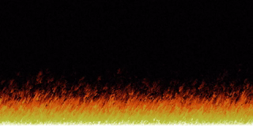

# Pixel Fire

Doom-esque pixel fire animation created in JavaFX.

## How to run

If you do not have Maven installed, use the wrapper commands (either mwnw.cmd for Windows or mvnw for Unix instead of mvn in the following commands)

1. Clone the repository and navigate into the root directory.
2. Run `mvn clean install`
3. Run `mvn exec:java`

## Acknowledgements

Based off an excellent [blogpost](http://fabiensanglard.net/doom_fire_psx/) by Fabien Sanglard.